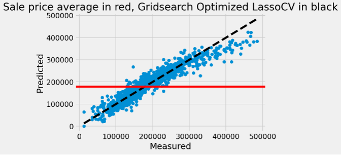

### Contents:
- [Problem Statement](#Problem-Statement)
- [Executive Summary](#Executive-Summary)
- [Data Dictionary](#Data-Dictionary)
- [Model Selection](#Model-Selection)
- [Conclusion](#Conclusion)

# Problem Statement

Common Good Reality based out of Ames, Iowa has been working on developing an online Home Buyers Toolbox to help make the home buying process easier for their customers. Outside research shows that the average home buyer visits 10 houses over 10 weeks before settling on the right home. ([source](https://www.realtor.com/advice/buy/how-many-homes-will-it-take/)) It is a massive financial and life decision as home purchasers stay in a newly purchased home for aproximately 13 years. ([source](https://www.nar.realtor/blogs/economists-outlook/how-long-do-homeowners-stay-in-their-homes#:~:text=As%20of%202018%2C%20the%20median,U.S.%20is%2013%20years1.)) The goal of this project is to reduce the time it takes for home-seekers who work with Common Good Reality to find the right fit home thereby increasing sales, reducing time spent by our realtors on each customer, and increasing the company's referral rate by providing a better home match for the budget of each customer. 

# Executive Summary

To meet this end, Common Good Reality requires a model that focuses on both deteriminates and reliability of results for home sale price in order to create an online feature for their Home Buyers Toolbox that allows customers to enter a budget and see their available features before meeting with a realtor. In effect, build their dream home, match it with a list of closest available houses on the market, and start the home search using that ordered list. This scope of this project is to examine the determinates of house sale prices in Ames, Iowa to assist in building this feature.

The data set used includes 2051 records and 81 feature columns. The complete data dictionary can be found [here](http://jse.amstat.org/v19n3/decock/DataDocumentation.txt). 

These 81 feature columns are combined to better represent the drivers of sale price or dropped if the feature does not add to the explanation of sale price in a significant way. The model uses 31 features. Features were selected using a combination of correlation to house sale price, lassocv as feature selection, p-value evaluation, and domain knowledge. Missing values were filled with a combination of zero values and averages based on the requirement of the feature. In total only 13 records were dropped from the original dataset. The selected model was not the best at predicting price, but instead is the best balance of predictability and interperability. The chosen model has an R^2 score of around 89%, compared to the best predictive model which is around 92% R^2. R^2 is a measure of how well the data fits the model's predicted regression line. The interperability of coefficients is paramount for creating this Home Buyers Toolbox feature. The feature will work off of this model's regression formula, where selected features will equal the users house budget, which is measured in house sale price. There is additional work that needs to be done in order for this model to be deployed into production, including working with a front-end engineer to design and implement the model formula on Common Good Reality's website.  

# Data Dictionary

|Feature Name|Coefficient Value|Grouping|Description|Engineered Variable|Variable type|
|---|---|---|---|---|---|
|neighborhood_order|7860.701765|Location Feature|Neighboorhood binned by price (1-4)|Yes, binned|Ordinal|
|local_conditions|3209.070961|Location Feature|Location Features binned by desirability (1-3)|No change|Ordinal|
|was_remodeled|2962.876302|Interior Feature|If the house was remodeled (1), if not (0)|Yes, binned|Dummy|
|overall_qual|13421.06003|Interior Feature|Overall quality of house material (1-10) |No change|Discrete|
|bsmt_qual|2127.927051|Interior Feature|Overall quality of basement material (0-4) |No change|Ordinal|
|bsmt_type*sf_all|11299.30046|Interior Feature|Basement livability multiplied by bsmt sqft|Yes, Interaction variable|Continuous|
|bsmt_exposure|2386.919623|Interior Feature|Outside exposure of bsmt (if exists) (0-4)|Yes, binned|Ordinal|
|heating_qc|1353.339957|Interior Feature|Heating quality and condition (1-5)|Yes, binned|Ordinal|
|kitchen_qual|6426.365647|Interior Feature|Kitchen Quality (1-5)|Yes, binned|Ordinal|
|fireplace_qu|3323.038105|Interior Feature|Fireplace Quality (if exists) (0-5)|Yes, binned|Ordinal|
|quality_above_sqft|22307.03523|Interior Feature|Finished sqft of house above ground|Quality (1-5) multiplied by sqft above ground|Continuous|
|totrms_abvgrd|1040.596013|Interior Feature|Total rooms above ground|No change|Discrete|
|room_size|1750.40569|Interior Feature|Average size of above ground rooms in sqft|Yes, total rooms divided by total sqft|Continuous|
|age|-1677.419602|Home Type Feature|Age of house at time of sale|Year house sold minus year house built|Discrete|
|house_style_condensed_2.0|-4695.649377|Home Type Feature|1 if a two story house, 0 if 1 story house |Yes, dummied|Dummy|
|bldg_type_TwnhsE|-3003.368337|Home Type Feature|1 if Townhouse end unit |Yes, in reference to single-fam house|Dummy|
|bldg_type_Twnhs|-1794.138528|Home Type Feature|1 if Townhouse inside unit|Yes, in reference to single-fam house|Dummy|
|bldg_type_2fmCon|-442.003601|Home Type Feature|1 if Two family conversion house|Yes, in reference to single-fam house|Dummy|
|exter_qual|6593.363165|Exterior Feature|Overall External material quality (1-5)|No change|Ordinal|
|external_feature|1707.190312|Exterior Feature|External Feature binned by desirability (1-10)|Yes, combination of Exterior 1 and 2|Ordinal|
|is_hip_roof|2296.773492|Exterior Feature|1 if roof type flat/hip/shed, 0 if mansard/gable/gabrel|Yes, dummied|Dummy|
|mas_vnr_area|3826.421751|Exterior Feature|Masonry veneer area in square feet|No change|Continuous|
|functional|3075.948105|Exterior Feature|1 if no deduction from damage, else 0|Yes, binned|Dummy|
|lot_frontage|2032.889459|Exterior Feature|Area in square feet of property connected to street|No change|Continuous|
|lot_area|3744.877281|Exterior Feature|Lot area in square feet|No change|Continuous|
|developed_outside_sf|2413.844257|Exterior Feature|Deck and patio space|Yes, combination of deck and patio sqft|Continuous|
|garage_fin*sqft|5838.208998|Exterior Feature|Quality garage space|Quality of garage finish multiplied by sqft garage|Continuous|
|garage_cars|1602.234917|Exterior Feature|Number of vehicles garage can fit|No change|Discrete|
|paved_drive|378.7386|Exterior Feature|If driveway unpaved, dirt/gravel, paved (1-3)|Yes, binned into ordinal|Ordinal|

# Model Selection

A number of linear regression models were tested on this dataset. Each of those models went through several iterations. Here are the results of the models evaluated on the final data set. Additional details can be found in the project notebook model evaluation.

|Models Used|R^2|Root Mean Square Error in Dollars|Pipeline Built|Hyperparameter Optimization|Pro|Con|RMSE Score on unseen Kaggle Comp. data|
|---|---|---|---|---|---|---|---|
|Baseline Model|0|73,422.04|No|No|Very simple|Horrible at predictions|---|
|Scaled Linear Regression|0.8837|22,774.47|No|No|P-values|Higher bias|---|
|RidgeCV Linear Regression|0.8837|22,776.53|No|Standard Scaler, Alphas using RidgeCV|Regularizes data, but so does Lasso|Did not score as high as Lasso|Did not score as high as Lasso|
|RidgeCV Linear Regression V2|0.8941|22,775.81|Yes|Standard Scaler, Alphas using GridSearch|Regularizes data, but so does Lasso|Did not score as high as Lasso|Third Best|
|LassoCV Linear Regression V1|0.8837|22,774.47|No|Standard Scaler, Alphas using LassoCV|Used in feature selection|Not Gridsearch optimized||
|LassoCV Linear Regression V2|0.8941|22,780.60|Yes|Standard Scaler, Alphas using GridSearch|Interperable Coefficients|Not the best R^2|Second Best -SELECTED MODEL|
|LassoCV Linear Regression V3|0.9209|16,804.05|Yes|Standard Scaler, Alphas, Polynomial Features using GridSearch|Best at predicting values, minimizing RMSE|Unable to interpret coefficients|Best|
|Elastic Net Linear Regression|0.8938|22,852.09|Yes|Standard Scaler, Alphas using GridSearch|Combines Ridge and Lasso|Not as good as Ridge or Lasso|Did not score as high as Lasso, better than Ridge|

Each model served its purpose in arriving at the final selected model. The baseline model, with a Root Mean Squared Error (RMSE) of 73,422.04 dollars served as a mark of how much the later model iterations improved on the mean sale price of the data set. The final chosen model had a RMSE 50,641.44 dollars better than the baseline model. The Linear Regression model served as a means to check p-values of coefficients, although this was only done as a fourth and final step in feature selection and a couple features do not have a p-value low enough to be considered statistically significant. I chose to keep them in the model based on domain knowledge and overall model performance. The LassoCV V1 was utilized in the third step of feature selection, following correlation as step two and domain expertise/intuition as step one. The best performing model in all catagories was the LassoCV Linear Regression V3, which utilized Polynomial features in gridsearch. Because of this, however, the model's coeficients are very difficult to interpert. Since coeficient interperability is paramount to the scope of the project this model was not selected as the final model. LassoCV Linear Regression V2 was selected because it is the best balance of interperability, r^2, RMSE, and predictions on an unseen Kaggle competition dataset. See figure below showing the predictions of the chosen model on the data training set.

# Conclusion

The model performs best on low, middle, and middle upper-class homes, but over-predicts house prices at the top of the sale price range. This is due to an underlying skew in the data. Future iterations of this model can correct for this this skew by taking a square or log of the sale price in an attempt to get price closer to a normal distribution or the tool can limit itself to home buyers with budgets less than around 300,000 dollars, which is the majority of our home sales. Overall the model does an excellent job at predicting house price and explaining the determinants of house sale price. This model will be useful, but does require additional work before being production ready. Limitations in the datatime scope (no new data since 2011) should be remedied before moving to production and integration into the Home Buyers Toolbox. If this model is successful in Ames, Iowa a similar model could be rolled out to additional cities, based on the assessor office data of these municipalities. The model feature binning creation is based on dictionary conversions, which are easily updatable by affordable analysts. It would not cost much to expand the model to other cities if successful. This should only be considered if there is a measureable increase in commissions and decrease in time to house purchase for new clients. 